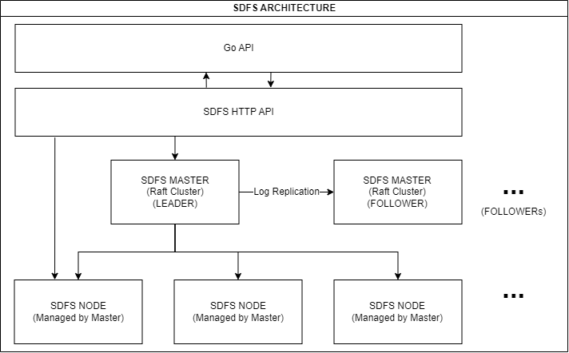

# Simple Distributed File System

SDFS is a distributed file system based on Raft consensus algorithm.

## Quickstart

### Compile from source
```bash
# master
git clone https://github.com/Lyianu/sdfs.git
cd sdfs
go build -o sdfs_master cmd/master/main.go
```
    
```bash
# node
git clone https://github.com/Lyianu/sdfs.git
cd sdfs
go build -o sdfs_node cmd/node/main.go
```

### Run
```bash
# master
./sdfs_master -a svr2.example.com -c svr1.example.com -l :8080
# this will start a master server at svr2.example.com:8080, it will join raft cluster via svr1.example.com, port 8080 will be used for HTTP API, port 9000 will be used for raft communication(gRPC)

# Usage of ./sdfs_master:
#   -a string
#         server address
#   -c string
#         specify a server to connect
#   -l string
#         listen address (default ":8080")
```
    
```bash
./sdfs_node -a node1.example.com -m svr2.example.com -p :8080
# this will start a node server at node1.example.com:8080, it will connect to master cluster via svr2.example.com, port 8080 will be used for HTTP API

# Usage of ./sdfs_node:
#   -a string
#         node address
#   -m string
#         master address(including port)
#   -p string
#         node port (default "8080")
```

## Architecture
